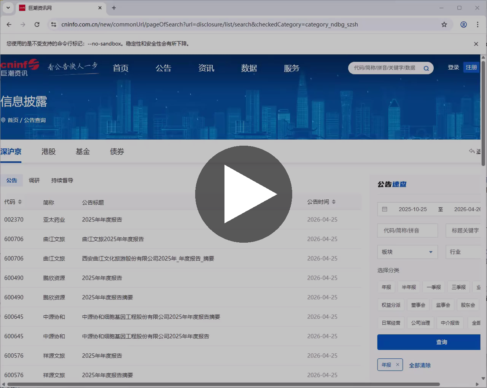

# web-data-scraper

**用 AI 的方式，做数据采集这件事。**

web-data-scraper 是一个面向 Claude Code 的通用网站数据采集技能。它的核心理念很简单：**像人一样操作网站，像程序一样批量获取数据**。

> **开源说明**：本项目旨在分享一种 AI 辅助数据采集的思路与范式，未包含脚手架代码和详细配置。如果你在 AI 辅助数据收集方面有需求，欢迎联系团队获取专业服务支持。详见 [开源说明](OPEN_SOURCE.md)。

---

## 它解决什么问题

日常工作中，我们经常需要从各类网站批量获取信息——下载公告、提取数据表、搜索特定报告。传统方案要么依赖专业爬虫工具（门槛高、维护难），要么手动逐页操作（效率低、易出错）。

web-data-scraper 提供了第三条路：让 AI 充当你的"智能助手"，自主完成从网站分析到数据采集的全流程。

## 设计理念

### 分析师的思路 + 程序员的技巧

这个技能的核心设计融合了两种思维：

1. **分析师的操作思路**：先打开网页看看长什么样，找到搜索入口，输入条件，查看结果——完全模拟真实用户的使用路径
2. **程序员的编程技巧**：在浏览器操作的过程中，抓取背后的网络请求，解析 API 接口，将单次的人工操作转化为可批量执行的自动化流程

### API 优先 + 浏览器兜底

面对任意网站，它会自动选择最优策略：

```
打开目标页面 → 监听网络请求
  ├─ 发现了 JSON API？→ 直接调用 API 批量获取（最高效）
  ├─ 没有发现 API？→ 用浏览器自动化模拟操作（通用性强）
  └─ 页面是静态的？→ 直接读取页面内容（最简单）
```

这种混合策略意味着：**能走快通道就走快通道，走不通也有备用方案**。

### 合理、合规、高效

- 模拟真人操作节奏，请求频率控制在合理范围内
- 优先使用网站自身的 API 接口，而非暴力抓取
- 遇到验证码等反爬机制时，主动降级而非强行突破
- 支持断点续传，任务中断后可从上次位置继续

---

## 典型使用场景

- **批量下载公告报告**：从巨潮资讯、中国货币网等网站按条件检索并下载 PDF
- **提取网页表格数据**：从统计局、交易所网站导出结构化数据（CSV / Markdown）
- **自动化信息查询**：在政府采购网等平台按关键词搜索并汇总结果
- **定期数据采集**：配置化地重复执行采集任务

---

## 实战案例：巨潮资讯 REITs 报告批量下载

下方录屏展示了一个完整的真实任务：**在巨潮资讯网上检索并下载全部 REITs 产品的一季度报告和 2025 年评估报告**。

这是一个极具代表性的复杂任务——目标抽象（"所有 REITs"）、来源分散（各产品独立披露）、文档类型多样（一季报 + 评估报告）。以下是执行结果：

### 任务成果

| 指标 | 结果 |
|------|------|
| 执行耗时 | 约 20 分钟 |
| 下载文件 | **50 个 PDF** |
| 其中一季报 | 26 只 REITs 的一季度报告 |
| 其中评估报告 | 24 只已披露的 2025 年评估报告 |
| 异常识别 | 2 只产品未发布报告 + 1 只新产品尚无任何报告 |

20 分钟看起来不短，但设计初衷就是让用户在此期间完全无需介入——发起任务后即可去做别的事，回来时任务已完成。

### 异常处理

在这次任务中，它准确识别了以下特殊情况：

- **红土创新盐田港 REIT** 和 **华夏安博仓储物流 REIT**：在巨潮网上未发布相关报告
- **中航北京保障性租赁住房 REIT**：作为新产品，尚无任何报告

### 两个令人印象深刻的细节

**1. 突破视觉限制**

在产品选择框中输入"REIT"时，人工操作通常只能看到下拉弹出的部分简略列表（受浏览器显示区域限制）。但该技能通过捕获背后的 API 请求，直接拉取到了完整版的 REITs 产品列表——这是传统手动操作根本无法做到的。

**2. 逻辑自愈能力**

执行过程中曾出现过一次误判：将"评估报告"误下载成了"一季度业绩说明会公告"。原因是匹配逻辑中使用了 `any` 而非 `all`，导致标题只要含有"2025"就会被错误匹配。当问题被指出后，它立即检查并修正了匹配逻辑，最终正确完成了全部下载。

尽管过程中出现了小插曲，但对于这样一个多步骤、多条件的复杂任务，最终完成度依然令人满意。

---

## 技术架构

```
web-data-scraper/
├── README.md                       # 项目介绍（本文件）
├── OPEN_SOURCE.md                  # 开源说明
├── LICENSE                         # CC BY-NC 4.0 授权协议
├── SKILL.md                        # 技能定义与三阶段工作流
├── 录屏合并.mp4                     # 实战案例演示视频
├── scripts/                        # [未包含] 脚手架代码
├── references/                     # [未包含] 方法论与网站操作指南
└── assets/                         # [未包含] 网站配置模板
```

完整的技术架构和工作流定义见 [SKILL.md](SKILL.md)，各目录的说明见 [OPEN_SOURCE.md](OPEN_SOURCE.md)。

### 工作流程

```
阶段 A：网站分析
  打开页面 → 截图 + 页面结构分析 → 网络请求监听 → 确定数据获取策略

阶段 B：数据查询与提取
  按选定策略执行 → 搜索/筛选/翻页 → 提取目标数据

阶段 C：数据保存
  结构化数据 → CSV + Markdown
  文件类数据 → 批量下载（自动重试、断点续传）
```

---

## 为什么说这是一种理想的范式

web-data-scraper 的本质是 **利用 AI 的编码能力为信息收集场景赋能**。它不是传统意义上的爬虫工具，而是一种新型的工作方式：

- **无需预先配置**：面对新网站，AI 自主分析页面结构并制定策略
- **智能策略选择**：自动判断最优获取方式（API / 浏览器 / 直读）
- **自主异常处理**：遇到问题时主动分析原因并调整方案
- **人人可用**：用自然语言描述需求即可，无需编写代码

这可能是目前 AI 辅助网站信息搜索的一种非常理想的范式——以合规、合理且高效的方式，将重复性的信息采集工作交给机器完成。

---

## 演示视频

以下录屏展示了完整的实战任务过程（巨潮资讯 REITs 报告批量下载），点击即可播放：

[](https://github.com/timyefi/web-data-scraper/blob/master/录屏合并.mp4)
